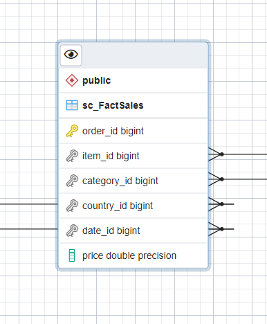

# Ecommerce Data Warehousing Project 

### Overview

You are a data engineer at an e-commerce company. Your company needs you to design a data platform that uses MySQL as an OLTP database. You will be using MySQL to store the OLTP data.

### Design the OLTP Database

Create a database named sales.

Design a table named sales_data based on the sample data given.

Import the data from oltpdata.csv into sales_data table using phpMyAdmin.

List the tables in the database

Write a query to find out the count of records in the tables sales_data

Create an index named ts on the timestamp field.

List all indexes created on this table 

Write a bash script named datadump.sh that exports all the rows in the sales_data table to a file named sales_data.sql

### Design a Data Warehouse

You are a data engineer hired by an ecommerce company named SoftCart.com . The company retails download only items like E-Books, Movies, Songs etc. The company has international presence and customers from all over the world. The company would like to create a data warehouse so that it can create reports like
- total sales per year per country
- total sales per month per category
- total sales per quarter per country
- total sales per category per country
You will use your data warehousing skills to design and implement a data warehouse for the company.

Design a Data Warehouse using the pgAdmin ERD design tool in Postgres

Using the ERD design tool design the table softcartDimDate. The company is looking at a granularity of a day. Which means they would like to have the ability to generate the report on yearly, monthly, daily, and weekday basis.

Using the ERD design tool design the table softcartDimCategory.

Using the ERD design tool design the table softcartDimItem.

Using the ERD design tool design the table softcartDimCountry.

Using the ERD design tool design the table softcartFactSales.

Using the ERD design tool design the required relationships(one-to-one, one-to-many etc) amongst the tables.

Download the schema sql from ERD tool and create the schema in a database named staging.

### Report Data Warehouse

Create an instance of IBM DB2 database on cloud

Load this data into DimDate table.

Load this data into DimCategory table.

Load this data into DimCountry table.

Load this data into FactSales table.

Create a grouping sets query using the columns country, category, totalsales.

Create a rollup query using the columns year, country, and totalsales.

Create a cube query using the columns year, country, and average sales.

Create an MQT named total_sales_per_country that has the columns country and total_sales.

Load sales data history into DB2 database 

Create a line chart of month wise total sales for the year 2020.

Create a pie chart of category wise total sales.

Create a bar chart of Quarterly sales of mobile phones

### ETL – Data Pipeline 
You need to keep data synchronized between different databases/data warehouses as a part of your daily routine. One task that is routinely performed is the sync up of the transactional database and staging data warehouse. Automating this sync-up will save you time and standardize your process.
Create a shell script to 

Extract the data using increamental load from the MySQL database to extract data added in the last 4 hours and then load it into the PostgreSQL Staging warehouse 

Transform the data into staging database and create DimDate 

Transform the data into staging database and create  FactSales table

Export the tables as CSV files for loading into the production warehouse.

Schedule a cron job to automate these tasks

